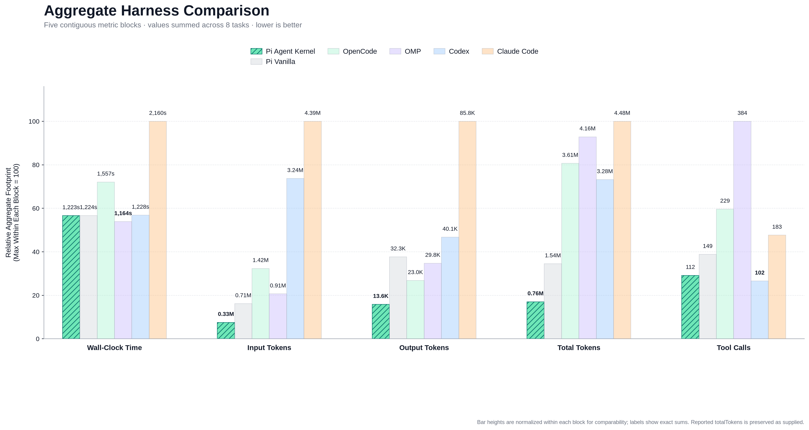

# pi-agent-kernel


Most coding agents drown in context. They read entire files when looking for a single function, dump thousands of lines of terminal logs into prompts, and rewrite full files just to tweak one line. `pi-agent-kernel` is built around a straightforward rule: **spend the bare minimum tokens necessary to get maximum workflow performance**. It provides surgical retrieval, bounded outputs, and guarded editing tools so your model stays fast, focused, and well within budget.

---

## Token savings

Here is how tool overhead compares to an unconstrained agent harness across everyday coding tasks:

| Interaction | Traditional agent harness | `pi-agent-kernel` (Passive Shield) | Tokens saved | Why |
|---|---|---|---|---|
| **Whole Benchmark Suite (8 tasks)** | Sprawling context / heavy tool suite (1.21M tokens) | Passive Shield + Supercharged Core 4 (465k tokens) | **-61.7% fewer tokens** | Gates speculative tools, stops schema overhead, and prevents tool distraction loops. |
| **Monorepo navigation (Zod, 140k+ LOC)** | Sprawling directory scans & full file dumps (104k tokens) | Surgical AST & clean plain reads (`read`) (50.5k tokens) | **-51.5% fewer tokens** | Capped 50KB/2,000-line reads and precise AST symbol targeting without hash overhead. |
| **Patching & Delimiter Repair** | Repetitive edit retry loops due to cutoffs (16.7% fail rate) | Tree-sitter & lexical auto-healing (`edit`) | **Zero-retry syntax healing** | Deterministically restores truncated closing braces/brackets before writing. |
| **Running tests / builds** | Floods context with raw build logs (~20k+ tokens) | Clamped output with disk spillover (~1.0k tokens) | **~95% context saved** | Full logs written to disk; agent sees head, tail, and log path. |
| **Function Inspection** | Reads full file with line hashes (~4.0k tokens) | Clean plain-text reads or symbol extraction (~420 tokens) | **~70–90% fewer tokens** | Clean plain text by default; surgical AST symbol targeting. |

---

## Cross-harness benchmark & reproducibility

`pi-agent-kernel` is continuously evaluated using an 8-task specified-repair benchmark suite derived from real-world bug fixes merged in popular open-source repositories (`hono`, `ky`, `zod`, `ufo`, `picomatch`, `fastify`, `uuid`, `p-limit`). The prompts describe the observed failure and expected behavior; they intentionally omit the original implementation diagnosis and prescribed code change.

### Cross-Harness 8-Task Benchmark on GPT 5.6 Luna High (`cx/gpt-5.6-luna:high`)

All 6 harnesses were evaluated across all 8 tasks under identical prompts and repository states on **`cx/gpt-5.6-luna:high`** via **`OmniRoute`**:

| Harness | Tasks Solved | Success Rate | Total Time | Cumulative Input Tokens | Output Tokens | Total Turn Tokens | Total Tool Calls |
|---|:---:|:---:|---:|---:|---:|---:|:---:|
| **Pi + Agent-Kernel** | **8 / 8** | **100%** | **918s (15.3m)** | **497,851** | **17,569** | **829,788** | 124 |
| **Pi (Vanilla)** | **8 / 8** | **100%** | **891s (14.8m)** | 504,695 | 16,971 | **765,890** | **79** |
| **Codex CLI** | **8 / 8** | **100%** | 856s (14.3m) | 1,050,222 | 19,538 | 1,069,760 | **58** |
| **OpenCode** | **8 / 8** | **100%** | 1,181s (19.7m) | 1,092,810 | 12,941 | 1,819,240 | 130 |
| **OMP** | **8 / 8** | **100%** | 971s (16.2m) | 745,744 | 14,644 | 1,933,380 | 218 |
| **Claude Code** | 7 / 8 | 88% | 943s (15.7m) | 1,945,983 | 57,430 | 2,003,413 | 104 |

> **Benchmark scope**: This measures implementation, diagnosis, retrieval, and verification from behavioral reports—not blind application of a supplied patch recipe. Results from older runs used more prescriptive prompts and should not be compared directly with runs using the current prompt set.
>
> **Efficiency Comparison**: **Pi (Agent-Kernel and Vanilla)** lead the benchmark by a wide margin over external CLI harnesses, consuming less than half the total tokens of **OpenCode** (1.82M tokens, **-54.4%**), **OMP** (1.93M tokens, **-57.1%**), and **Claude Code** (2.00M tokens, **-58.6%**). OpenCode achieved 100% solve rate across all 8 tasks, but its verbose git-diff and patch format resulted in over 1.8M tokens compared to Pi's surgical range-bounded edits.



### Running the benchmark locally

```bash
# 1. Copy and customize configuration
cp agent-kernel-benchmark/.env.example agent-kernel-benchmark/.env

# 2. Run the full benchmark suite
npm run bench

# Or run a specific task / harness
npx tsx agent-kernel-benchmark/run.ts task-3
npx tsx agent-kernel-benchmark/run.ts --harnesses pi-kernel,pi-vanilla

# 3. Clean transient workspaces
npm run bench:clean

# 4. Generate the comparison chart from benchmark results
npm run bench:chart
```

See [`agent-kernel-benchmark/README.md`](agent-kernel-benchmark/README.md) for full configuration details, CLI flags, and task descriptions, and [`agent-kernel-benchmark/BENCHMARK_RESULTS.md`](agent-kernel-benchmark/BENCHMARK_RESULTS.md) for task-by-task forensic analysis.

---

## Quick start

### 1. Install

Install the extension directly with Pi's package manager:

```bash
# Global install (recommended)
pi install npm:@floydous/pi-agent-kernel

# Or install locally for the current repository only
pi install -l npm:@floydous/pi-agent-kernel
```

Restart Pi or start a new session. The extension registers its tools, guards, status indicators, and kernel workflow guidance automatically.

The compact `AGENT_KERNEL_SYS_PROMPT.md` is injected into each agent run through Pi's `before_agent_start` lifecycle hook. This keeps the guidance bundled with the extension instead of requiring a manual `--context-file` flag. Disable it with `[instructions] enabled = false` in `config.toml` when running an unassisted baseline.

---

### 2. Configure the retrieval engine (`/engine`)

`pi-agent-kernel` includes an in-memory retrieval engine for keyword and semantic searches, surfaced directly on the extension status line:

```text
/engine status
```

- **`lean`** *(default)*: `🌿 retrieval:bm25` — Fast, AST-aware BM25 search. Consumes 0 MB background model RAM.
- **`hybrid`**: `◈ retrieval:hybrid-256d` — BM25 keyword search blended with lightweight local 256-dimension Matryoshka embeddings.
- **`full`**: `🧠 retrieval:dense-768d` — Dense 768-dimension semantic embeddings for deep conceptual queries across large codebases.
- **`off`**: Turns off local index building if you only want AST and LSP tools.

During indexing, the statusline displays live throughput metrics and progress:
```text
🧠 retrieval:dense-768d ⇢ 45% (22/48 • 14.2 chunk/s) • ○ 🐴 ponytail: ⚡ FULL
```

Switch profiles at any time:
```text
/engine hybrid
# or
/engine full
```

---

### 3. Configure codebase scale profile (`/profile`)

Agent-kernel automatically scales its prompt context to the size of the repository. On light repositories (<10 implementation files, <50 KB code), the 1,024-token PageRank map is suppressed to minimize token usage. On larger projects, the map is injected automatically.

You can view or override this setting at any time:
```text
/profile status     # Check current profile and detected codebase metrics
/profile light      # Force light profile (suppress automatic repo-map injection)
/profile heavy      # Force heavy profile (always inject PageRank repo map)
/profile auto       # Auto-detect based on implementation code volume (default)
```
Or configure via environment variable:
```bash
export PI_CODEBASE_PROFILE=light   # or "heavy", "auto", "smart"
```

---

### 4. Setup language servers (`/lsp`)

Get real-time compiler diagnostics, definitions, and references without manual setup:

```text
/lsp
```

Running `/lsp` opens an interactive management screen showing active servers, connection status, and one-click installs for detected workspace languages.

Alternatively, install a server directly from the command line:
```text
/lsp install <language>    # e.g., python, typescript, rust, go, csharp, etc.
```

---

### 5. Tip: Turn off Pi documentation when working on your own projects

By default, Pi loads system prompt instructions explaining how to extend Pi itself (extensions, themes, skills, and TUI APIs).

When you are working on your own software—such as a React app, a Python backend, or a Rust crate—those internal Pi instructions take up room in your prompt that you do not need. You can silence them for the current session with:

```text
/pi-docs off
```

Turn it back on with `/pi-docs on` whenever you switch back to hacking on Pi extensions.

---

## Tool reference

### Core Tools (Active by Default)
| Tool | What it does |
|---|---|
| `read` | Read clean plain text with 50KB/2,000-line safety caps, or extract an exact function, class, or type via AST (`symbol="name"`). |
| `edit` | Apply surgical search/replace patches with automatic delimiter auto-healing and optional `line_hint` disambiguation. |
| `write` | Create new files or perform complete rewrites when explicitly requested. |
| `bash` | Execute shell commands (e.g. `rg`, `git status`, test runners) with clamped output and automatic disk spillover logging. |

### Exploratory Retrieval Tools (Gated behind Passive Shield)
*Enabled via `PI_ENABLE_RETRIEVAL_TOOLS=1` or `[retrieval] enable_tools = true` in `config.toml`:*
| Tool | What it does |
|---|---|
| `code_search` | Hybrid AST BM25 and semantic chunk search with breadcrumb locations for conceptual queries. |
| `ast_search` | Search declarations across files using Tree-sitter AST queries, grouped cleanly by file. |
| `get_repo_map` | Retrieve a concise, PageRank-ranked symbol overview of the codebase (~1k tokens). |
| `lsp` | Query definitions, references, type hover docs, and diagnostics directly from language servers. |

---

## License

ISC
